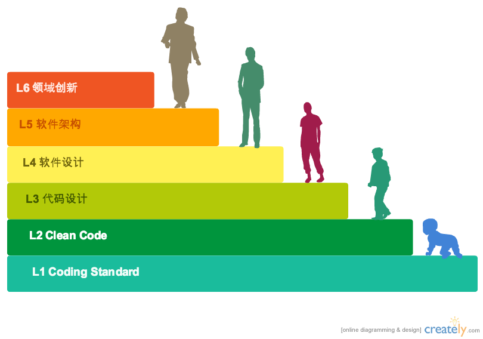

#技术人员成长模型-II

###整体分为6个Level:###
####1. 符合团队编码规范要求，能够胜任基本编码工作####
####2. 能够写出整洁、易理解的代码，对代码细节有追求####
####3. 灵活使用设计原则、设计模式解决代码级设计问题####
####4. 掌握多种设计范型，具备组合式设计及正交设计能力####
####5. 能够运用演进式设计，设计出符合领域的软件架构####
####6. 针对特定领域，提出业界领先的软件解决方案####

