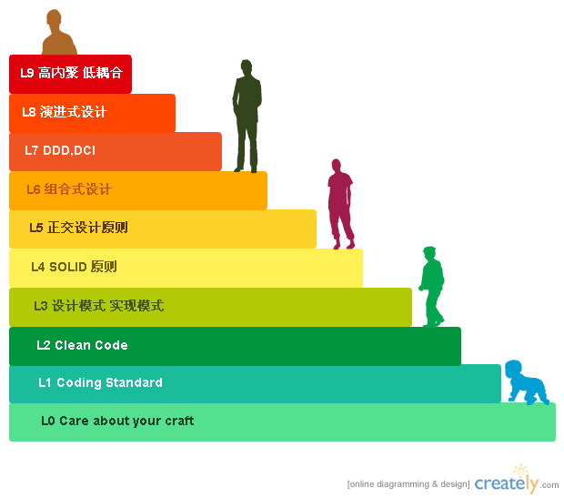

#技术人员成长模型-I

整体分为**10**个Level：  
1. 关心自己的技艺，追求好的代码、设计  
2. 符合部门、团队的代码规范  
3. 能写出整洁的代码  
4. 灵活运用实现模式、设计模式  
5. 深刻理解SOLID原则，指导日常的开发  
6. 深刻理解正交设计四原则，指导日常开发  
7. 设计呈现组合式风格，可以灵活拼装  
8. 能使用DDD，DCI指导自己的设计，整体设计层次分明，更贴近领域本身  
9. 深刻理解演进式设计的作用，能产生简单的设计  
10. 终极追求高内聚、低耦合，能对业务进行高度抽象，产生DSL，从根本上消除业务处理复杂度  

