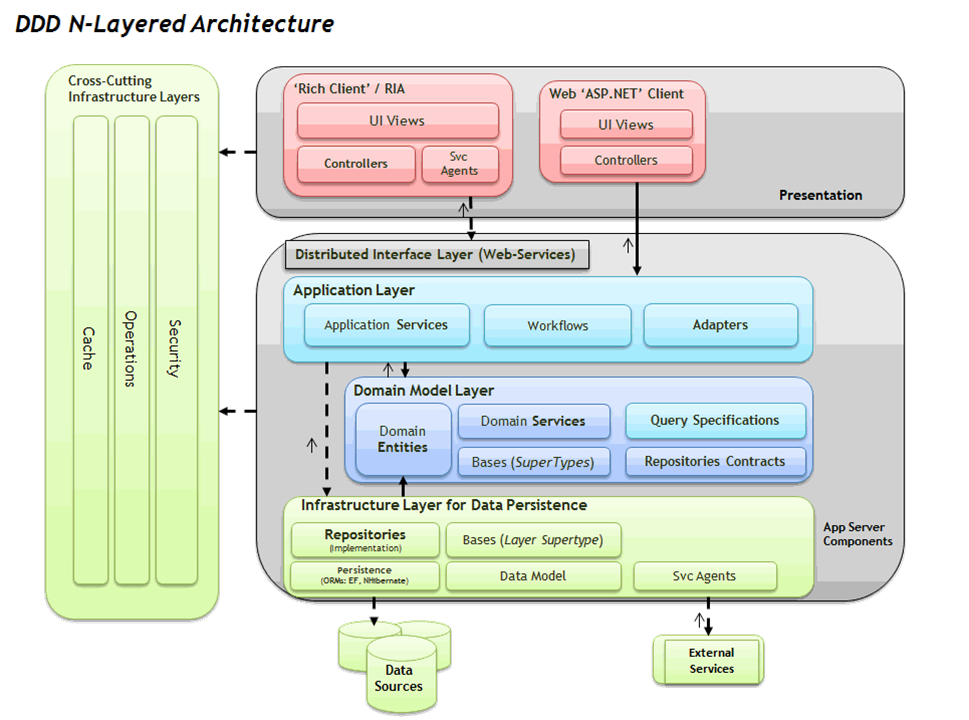

# Clean Code Examples

[TOC]

“Clean Code That Works”，来自于Ron Jeffries这句箴言指导我们写的代码要整洁有效，Kent Beck把它作为TDD（Test Driven Development）追求的目标，BoB大叔（Robert C. Martin）甚至写了一本书来阐述他的理解。  
整洁的代码不一定能带来更好的性能，更优的架构，但它却更容易找到性能瓶颈，更容易理解业务需求，驱动出更好的架构。整洁的代码是写代码者对自己技艺的在意，是对读代码者尊重。  
本文是对BOB大叔《Clen Code》^[1]^一书的一个简单抽取、分层，目的是整洁代码可以在团队中更容易推行，本文不会重复书中内容，仅提供对模型的一个简单解释，如果对于模型中的细节有疑问，请参考《代码整洁之道》^[1]^。

***

## I 基础级
基础级主要包括代码格式、注释、物理设计三部分，这三部分比较容易做到，甚至可以制定为团队的编码规范，保证团队代码保持统一风格。

### 1.1 格式
遵循原则：
+ 关系密切内容聚合
+ 关系松散内容分隔

注意事项：
+ 编码时使用等宽字体
+ 设置Tab为4个空格
+ 使用统一的编码格式：UTF-8, GB2312, GBK
+ 使用统一的代码格式化风格。例如经典风格 K&R, BSD/Allman, GNU, Whitesmiths[^eclipse内置的四种格式]
+ 控制行宽，不需要拖动水平滚动条查看代码

#### 1.1.1 横向格式
使用**空格**对内容进行分隔，使用锯齿缩紧对代码段进分隔
反例：
```java
public String toString() {
Point point=new Point();
StringBuilder sb=new StringBuilder();
sb.append("A B C D E F G H");
for(point.x=0;point.x<BOARD_LENGTH;point.x++){
sb.append('\n').append(point.x + 1);
for(point.y=0;point.y<BOARD_WIDTH;point.y++){
sb.append(' ').append(board.get(point).symbol());
}
}
sb.append('\n');
return sb.toString();
}
```
正例：
```java
public String toString() {
    Point point = new Point();
    StringBuilder sb = new StringBuilder();

    sb.append("  A B C D E F G H");
    for (point.x = 0; point.x < BOARD_LENGTH; point.x++) {
        sb.append('\n').append(point.x + 1);
        for (point.y = 0; point.y < BOARD_WIDTH; point.y++) {
            sb.append(' ').append(board.get(point).symbol());
        }
    }
    sb.append('\n');
    
    return sb.toString();
}
```
- - -

#### 1.1.2 纵向格式
使用**空行**对内容进行分隔，函数或类的方法不要太长，尽量能在视野范围内一览无余
反例：
```java
public class ComparisonCompactor {
    private static final String ELLIPSIS = "...";
    private static final String DELTA_END = "]";
    private static final String DELTA_START = "[";
    private int fContextLength;
    private String fExpected;
    private String fActual;
    private int fPrefix;
    private int fSuffix;
    @SuppressWarnings("deprecation")
    public String compact(String message) {
        if (fExpected == null || fActual == null || areStringsEqual()) {
            return Assert.format(message, fExpected, fActual);
        }
        findCommonPrefix();
        findCommonSuffix();
        String expected = compactString(fExpected);
        String actual = compactString(fActual);
        return Assert.format(message, expected, actual);
    }
    private boolean areStringsEqual() {
        return fExpected.equals(fActual);
    }
}
```
正例：
```java
public class ComparisonCompactor {

    private static final String ELLIPSIS = "...";
    private static final String DELTA_END = "]";
    private static final String DELTA_START = "[";

    private int fContextLength;
    private String fExpected;
    private String fActual;
    private int fPrefix;
    private int fSuffix;

    @SuppressWarnings("deprecation")
    public String compact(String message) {
        if (fExpected == null || fActual == null || areStringsEqual()) {
            return Assert.format(message, fExpected, fActual);
        }

        findCommonPrefix();
        findCommonSuffix();
        String expected = compactString(fExpected);
        String actual = compactString(fActual);
        
        return Assert.format(message, expected, actual);
    }

    private boolean areStringsEqual() {
        return fExpected.equals(fActual);
    }
}
```
### 1.2 注释
遵循原则：
+ 尽量不写注释，尝试用代码自阐述
+ 必要时增加注释

注意事项：
+ 擅用源码管理工具
+ 提交代码时，日志要详细
+ 确认编译器支持`//`
+ `/*`之后有空格， `*/`之前有空格

#### 1.2.1 好的注释
1. 法律、版权信息
```cpp
# /* **************************************************************************
#  *                                                                          *
#  *     (C) Copyright Paul Mensonides 2002.
#  *     Distributed under the Boost Software License, Version 1.0. (See
#  *     accompanying file LICENSE_1_0.txt or copy at
#  *     http://www.boost.org/LICENSE_1_0.txt)
#  *                                                                          *
#  ************************************************************************** */
#
# /* See http://www.boost.org for most recent version. */
#
# ifndef BOOST_PREPROCESSOR_SEQ_FOR_EACH_HPP
# define BOOST_PREPROCESSOR_SEQ_FOR_EACH_HPP
#
# include <boost/preprocessor/arithmetic/dec.hpp>
# include <boost/preprocessor/config/config.hpp>
# include <boost/preprocessor/repetition/for.hpp>
# include <boost/preprocessor/seq/seq.hpp>
# include <boost/preprocessor/seq/size.hpp>
# include <boost/preprocessor/tuple/elem.hpp>
# include <boost/preprocessor/tuple/rem.hpp>
#
```
2. 陷阱、警示
```cpp
#if (defined(BOOST_MSVC) || (defined(BOOST_INTEL) && defined(_MSC_VER))) && _MSC_VER >= 1300
//
// MSVC supports types which have alignments greater than the normal
// maximum: these are used for example in the types __m64 and __m128
// to provide types with alignment requirements which match the SSE
// registers.  Therefore we extend type_with_alignment<> to support
// such types, however, we have to be careful to use a builtin type
// whenever possible otherwise we break previously working code:
// see http://article.gmane.org/gmane.comp.lib.boost.devel/173011
// for an example and test case.  Thus types like a8 below will
// be used *only* if the existing implementation can't provide a type
// with suitable alignment.  This does mean however, that type_with_alignment<>
// may return a type which cannot be passed through a function call
// by value (and neither can any type containing such a type like
// Boost.Optional).  However, this only happens when we have no choice 
// in the matter because no other "ordinary" type is available.
//
```
3. 意图解释
```cpp
// Borland specific version, we have this for two reasons:
// 1) The version above doesn't always compile (with the new test cases for example)
// 2) Because of Borlands #pragma option we can create types with alignments that are
// greater that the largest aligned builtin type.

    namespace align
    {
        #pragma option push -a16
        struct a2{ short s; };
        struct a4{ int s; };
        struct a8{ double s; };
        struct a16{ long double s; };
        #pragma option pop
    }
```
4. 性能优化代码
```cpp
// Fast version of "hash = (65599 * hash) + c"
hash = (hash << 6) + (hash << 16) - hash + c;
```
5. 不易理解代码
```cpp
// kk::mm::ss, MM dd, yyyy
std::string timePattern = "\\d{2}:\\d{2}:\\d{2}, \\d{2} \\d{2}, \\d{4}";
```
---
#### 1.2.2 不好的注释
1. 日志型注释 -> 删除，使用源码管理工具记录  
    反例：
    ```java
    /**
     ＊c00kiemon5ter 2015-9-20 add  SquareState
     * c00kiemon5ter 2015-10-1 change the symbol
     */
    public enum SquareState {

        BLACK('●'),
        WHITE('○'),
    //	BLACK('x'),
    //	WHITE('o'),
        PSSBL('.'),
        EMPTY(' ');
        private final char symbol;

        SquareState(char symbol) {
            this.symbol = symbol;
        }

        public char symbol() {
            return this.symbol;
        }
    }
    ```
   正例：
    ```java
    public enum SquareState {
        BLACK('●'),
        WHITE('○'),
        PSSBL('.'),
        EMPTY(' ');
        private final char symbol;

        SquareState(char symbol) {
            this.symbol = symbol;
        }

        public char symbol() {
            return this.symbol;
        }
    }
    ```
  ```
  $git commit -m "change BLACK symbol from x to ●, WHITE from ○ to O"
  ```
2. 归属、签名 -> 删除，源码管理工具自动记录
   反例：
    ```java
    /**
     * @author c00kiemon5ter 
     */
    public enum Player {

        BLACK(SquareState.BLACK),
        WHITE(SquareState.WHITE);
        private SquareState color;

        private Player(SquareState color) {
            this.color = color;
        }

        public Player opponent() {
            return this == BLACK ? WHITE : BLACK;
        }

        public SquareState color() {
            return color;
        }
    }
    ```
    正例：
    ```java
    public enum Player {

        BLACK(SquareState.BLACK),
        WHITE(SquareState.WHITE);
        private SquareState color;

        private Player(SquareState color) {
            this.color = color;
        }

        public Player opponent() {
            return this == BLACK ? WHITE : BLACK;
        }

        public SquareState color() {
            return color;
        }
    }
    ```

3. 注释掉的代码 -> 删除，使用源码管理工具保存
```java
	public Point evalMove() {
		AbstractSearcher searcher;
		Evaluation evalfunc;
		searcher = new NegaMax();
        //evalfunc = new ScoreEval();
		evalfunc = new ScoreDiffEval();
        //evalfunc = new ScoreCornerWeightEval();
		return searcher.simpleSearch(board, player, depth, evalfunc).getPoint();
	}
```
4. 函数头 -> 尝试使用更好的函数名，更好参数名，更少参数替换注释
   反例：
    ```cpp
    /***********************************************************************
    * function Name: GetCharge
    * function description：get total Rental charge
    * return value：WORD32 
    * other
    * date    version     author     contents
    * -----------------------------------------------
    * 2014/11/28  V1.0	    XXXX	      XXXX
    *************************************************************************/
    WORD32 GetCharge(T_Customer* tCustomer)
    {
        ...
    }
    ```
    正例：
    ```cpp
    WORD32 GetTotalRentalCharge(Customer* customer)
    {
        ...
    }
    ```

5. 位置标记 -> 删除，简化逻辑
```java
	public static Set<Point> explore(final Board board, final SquareState state) {
		Set<Point> possibleMoves = new HashSet<Point>();
		Set<Point> statePoints = board.getSquares(state);
		for (Point seed : statePoints) {
			for (Direction direction : Direction.values()) {
				if (shouldSearch(board, seed, direction)) {
					Point nextPoint = direction.next(seed);
					nextPoint = direction.next(nextPoint);
					while (pointIsValid(nextPoint)) {
						if (board.getSquareState(nextPoint) == state) {
							break;
						} else if (board.getSquareState(nextPoint) == SquareState.EMPTY) {
							possibleMoves.add(nextPoint);
							break;
						}//end if
						nextPoint = direction.next(nextPoint);
					} //end while
				} //end if
			} //end for
		} //end for
		return possibleMoves;
	}
```
6. 过时、误导性注释 -> 删除
```java
// Utility method that returns when this.closed is true. Throws an exception 
// if the timeout is reached.
public synchronized void waitForClose(final long timeoutMillis) throws Exception 
{
    if(!closed)
    {
        wait(timeoutMillis);
        if(!closed)
        throw new Exception("MockResponseSender could not be closed"); 
    }
}
```
7. 多余、废话注释 -> 删除
```cpp
class GTEST_API_ AssertionResult 
{
    public:
    // Copy constructor.
    // Used in EXPECT_TRUE/FALSE(assertion_result).
    AssertionResult(const AssertionResult& other);
    // Used in the EXPECT_TRUE/FALSE(bool_expression).
    explicit AssertionResult(bool success) : success_(success) {}

    // Returns true iff the assertion succeeded.
    operator bool() const { return success_; }  // NOLINT

    private:
    // Stores result of the assertion predicate.
    bool success_;
};
```
---
### 1.3 物理设计
遵循原则^[4]^：
+ 头文件编译自满足（C/C++)
+ 文件职责单一
+ 文件最小依赖
+ 文件信息隐藏

注意事项：
+ 包含文件时，确保路径名、文件名大小写敏感
+ 文件路径分隔符使用`/`，不使用`\`
+ 路径名一律使用小写、下划线(`_`)或中划线风格(`-`)
+ 文件名与程序实体名称一致

#### 1.3.1 头文件编译自满足(C/C++)
对于C/C++语言头文件编译自满足，即头文件可以单独编译成功。  
反例：
```cpp
#ifndef _INCL_POSITION_H_
#define _INCL_POSITION_H_

#include "base/Role.h"

struct Position : Coordinate, Orientation
{
    Position(int x, int y, int z, const Orientation& d);
    bool operator==(const Position& rhs) const;

    IMPL_ROLE(Coordinate);
    IMPL_ROLE(Orientation);
};

#endif
```
正例：
```cpp
#ifndef _INCL_POSITION_H_
#define _INCL_POSITION_H_

#include "Coordinate.h"
#include "Orientation.h"
#include "base/Role.h"

struct Position : Coordinate, Orientation
{
    Position(int x, int y, int z, const Orientation& d);
    bool operator==(const Position& rhs) const;

    IMPL_ROLE(Coordinate);
    IMPL_ROLE(Orientation);
};

#endif

```

#### 1.3.2 文件设计职责单一
文件设计职责单一，是指文件中对于对于用户公开的信息，应该是一个概念，避免把不相关的概念糅合在一个文件中，文件间增加不必要的依赖   
反例：
```cpp
//UnmannedAircraft.h
#ifndef _INCL_UNMANNED_AIRCRAFT_H_
#define _INCL_UNMANNED_AIRCRAFT_H_

#include "Coordinate.h"
#include "Orientation.h"
#include "base/Role.h"

struct Instruction;

struct Position : Coordinate, Orientation
{
    Position(int x, int y, int z, const Orientation& d);
    bool operator==(const Position& rhs) const;

    IMPL_ROLE(Coordinate);
    IMPL_ROLE(Orientation);
};

struct UnmannedAircraft
{
    UnmannedAircraft();
    void on(const Instruction&);
    const Position& getPosition() const;

private:
    Position position;
};

#endif
```
正例：
```cpp
//Position.h
#ifndef _INCL_POSITION_H_
#define _INCL_POSITION_H_

#include "Coordinate.h"
#include "Orientation.h"
#include "base/Role.h"

struct Position : Coordinate, Orientation
{
    Position(int x, int y, int z, const Orientation& d);
    bool operator==(const Position& rhs) const;

    IMPL_ROLE(Coordinate);
    IMPL_ROLE(Orientation);
};

#endif
```
```cpp
//UnmannedAircraft.h
#ifndef _INCL_UNMANNED_AIRCRAFT_H_
#define _INCL_UNMANNED_AIRCRAFT_H_

#include "Position.h"

struct Instruction;

struct UnmannedAircraft
{
    UnmannedAircraft();
    void on(const Instruction&);
    const Position& getPosition() const;

private:
    Position position;
};

#endif
```

#### 1.3.3 仅包含需要的文件
1. 文件设计时，应遵循最小依赖原则，仅包含必须的文件即可。
    反例：
    ```cpp
    #ifndef _INCL_UNMANNED_AIRCRAFT_H_
    #define _INCL_UNMANNED_AIRCRAFT_H_

    #include "Position.h"
    #include "Orientation.h"
	#include "Coordinate.h"
    #include "Instruction.h"

    struct UnmannedAircraft
    {
        UnmannedAircraft();
        void on(const Instruction&);
        const Position& getPosition() const;

    private:
        Position position;
    };

    #endif
    ```
	正例：
    ```cpp
    #ifndef _INCL_UNMANNED_AIRCRAFT_H_
    #define _INCL_UNMANNED_AIRCRAFT_H_

    #include "Position.h"

    struct Instruction;

    struct UnmannedAircraft
    {
        UnmannedAircraft();
        void on(const Instruction&);
        const Position& getPosition() const;

    private:
        Position position;
    };
    #endif
    ```
2. 特别的，对于C++而言，可以使用类或者结构体前置声明，而不包含头文件，降低编译依赖。该类依赖被称为弱依赖，编译时不需要知道实体的真实大小，仅提供一个符号即可，主要有：
	+ 指针
	+ 引用
	+ 返回值
	+ 函数参数

  反例：
    ```cpp
    #ifndef _INCL_INSTRUCTION_H_
    #define _INCL_INSTRUCTION_H_

    #include "Coordinate.h"
    #include "Orientation.h"

    struct Instruction
    {
        virtual void exec(Coordinate&, Orientation&) const = 0; 
        virtual ~Instruction() {}
    };

    #endif
    ```
    正例：
    ```cpp
    #ifndef _INCL_INSTRUCTION_H_
    #define _INCL_INSTRUCTION_H_

    struct Coordinate;
    struct Orientation;

    struct Instruction
    {
        virtual void exec(Coordinate&, Orientation&) const = 0; 
        virtual ~Instruction() {}
    };

    #endif
    ```

#### 1.3.4 仅公开用户需要的接口
1. 文件设计时，应遵循信息隐藏原则，仅公开用户需要的接口，对于其他信息尽量隐藏，以减少不必要的依赖。  
    
	反例：
    ```cpp
    struct RepeatableInstruction : Instruction
    {
        RepeatableInstruction(const Instruction&, int n);   
        virtual void exec(Coordinate&, Orientation&) const; 
        bool isOutOfBound() const;
    private:
        const Instruction& ins;
        const int n;
    };
    ```
    正例：
    ```cpp
    struct RepeatableInstruction : Instruction
    {
        RepeatableInstruction(const Instruction&, int n);   
    private:
        virtual void exec(Coordinate&, Orientation&) const; 
        bool isOutOfBound() const;
    private:
        const Instruction& ins;
        const int n;
    };
    ```
2. 特别的，对于C可以使用static对全局变量、函数等进行隐藏，对于支持面向对象语言则使用其封装特性即可。  

	反例：
    ```cpp
    BOOLEAN isGbr(BYTE qci)
    {
        return qci >= 1 && qci <= 4;
    }

    BOOLEAN isGbrBitRateValid(const GbrIE* gbrIE)
    {
        ASSERT_VALID_PTR_BOOL(gbrIE);

        return gbrIE->dlGbr <= gbrIE->dlMbr &&
               gbrIE->ulGbr <= gbrIE->ulMbr;
    }

    BOOLEAN isGbrIEValid(const QosPara* qosPara)
    {
        if(!isGbr(qosPara->qci)) return TRUE;

        if(qosPara->grbIEPresent == 0) return TRUE;

        return isGbrBitRateValid(&qosPara->gbrIE);
    }
    ```
    正例：
    ```cpp
    static BOOLEAN isGbr(BYTE qci)
    {
        return qci >= 1 && qci <= 4;
    }

    static BOOLEAN isGbrBitRateValid(const GbrIE* gbrIE)
    {
        ASSERT_VALID_PTR_BOOL(gbrIE);

        return gbrIE->dlGbr <= gbrIE->dlMbr &&
               gbrIE->ulGbr <= gbrIE->ulMbr;
    }

    BOOLEAN isGbrIEValid(const QosPara* qosPara)
    {
        if(!isGbr(qosPara->qci)) return TRUE;

        if(qosPara->grbIEPresent == 0) return TRUE;

        return isGbrBitRateValid(&qosPara->gbrIE);
    }
    ```
---
## II 进阶级
进阶级主要包括命名、测试设计、数据结构及对象设计，该部分要求编码时关注到更多细节，从语义层次提升代码的可理解性。
### 2.1 命名
**命名是提高代码表达力最有效的方式之一**。我们都应该抱着谨慎的态度，像给自己孩子取名字一样，为其命名。好的名字，总能令人眼前一亮，令阅读者拍案叫绝，但好的名字往往意味着更多的思考，更多次尝试，体现着我们对代码的一种态度。随着我们对业务的进一步了解，发现名字不合适时，要大胆的重构他。

遵循原则：
+ Baby Names，宁思三分，不强一秒
+ Min-length ＋ Max-information
+ 结构体/类名用名词或名词短语
+ 接口使用名词或形容词
+ 函数/方法使用动词或动词短语

注意事项：
+ 避免使用汉语拼音
+ 避免使用前缀
+ 避免包含数据结构
+ 避免使用数字序列
+ 善用词典
+ 善用重构工具

#### 2.1.1 关注点
+ 文件夹｜包
+ 文件
+ 函数｜类方法｜类
+ 参数｜变量

#### 2.1.2 风格统一的命名规范
社区有很多种类的命名规范，很难找到一种令所有人都满意，如下规范仅供参考：

| Type | Examples |
|------|----------|
| namespace/package | std, details, lang|
| struct/union/class | List, Map, HttpServlet
| function/method | add, binarySearch, lastIndexOfSubList |
| macro/enum/constant | MAX_ERAB_NUM, IDLE, UNSTABLE |
| variable | i, key, expectedTimer |
| type | T, KEY, MESSAGE |

团队可以根据实际情况进行改动，但团队内命名风格要一致。

#### 2.1.3 避免在命名中使用编码
在程序设计的历史中，在命名中使用编码曾风靡一时，最为出名的为匈牙利命名法，把类型编码到名字中，使用变量时默认携带了它的类型，使程序员对变量的类型和属性有更直观的了解。

基于如下原因，现代编码习惯，不建议命名中使用编码：
+ 现代编码习惯更倾向于短的函数、短的类，变量尽量在视野的控制范围内；
+ 业务频繁的变化，变量的类型可能随之变化，变量中的编码信息就像过时的注释信息一样误导人；
+ 携带编码的变量往往不可读
+ 现代IDE具有强大的着色功能，局部变量与成员变量容易区分

由于历史原因，很多遗留代码仍然使用匈牙利命名法，修改代码建议风格一致，新增代码建议摒弃
+ 匈牙利命名示例
	反例：
    ```cpp
    void AddRental(T_Customer* tCustomer, BYTE byPriceCode, BYTE byDaysRented)
    {
        tCustomer->atRentals[tCustomer->byNum].byPriceCode  = byPriceCode;
        tCustomer->atRentals[tCustomer->byNum].byDaysRented = byDaysRented;

        tCustomer->byNum++;
    }
    ```
    正例：
    ```cpp
    static void doAddRental(Rental* rental, BYTE movieType, BYTE daysRented)
    {
        rental->movieType = movieType;
        rental->daysRented = daysRented;
    }

    void AddRental(Customer* customer, BYTE movieType, BYTE daysRented)
    {
        doAddRental(customer->rentals[customer->rentalNum++], movieType, daysRented);
    }
    ```
+ 成员变量前缀示例
	反例：
    ```cpp
    struct Coordinate
    {
        Coordinate(int x, int y, int z);

        Coordinate up() const;
        Coordinate down() const;
        Coordinate forward(const Orientation&) const;

        bool operator==(const Coordinate& rhs) const;

    private:
        int m_x;
        int m_y;
        int m_z;
    };
    ```
    正例：
    ```cpp
    struct Coordinate
    {
        Coordinate(int x, int y, int z);

        Coordinate up() const;
        Coordinate down() const;
        Coordinate forward(const Orientation&) const;

        bool operator==(const Coordinate& rhs) const;

    private:
        int x;
        int y;
        int z;
    };
    ```
+ 接口、类前缀示例  
    反例：
    ```cpp
    struct IInstruction
    {
        virtual void exec(CCoordinate&, COrientation&) const = 0; 
        virtual ~Instruction() {}
    };

    struct CRepeatableInstruction : IInstruction
    {
        CRepeatableInstruction(const IInstruction&, int n);   
    private:
        virtual void exec(CCoordinate&, COrientation&) const; 
        bool isOutOfBound() const;
    private:
        const IInstruction& ins;
        const int n;
    };
    ```
    正例：
    ```cpp
    struct Instruction
    {
        virtual void exec(Coordinate&, Orientation&) const = 0; 
        virtual ~Instruction() {}
    };

    struct RepeatableInstruction : Instruction
    {
        RepeatableInstruction(const Instruction&, int n);   
    private:
        virtual void exec(Coordinate&, Orientation&) const; 
        bool isOutOfBound() const;
    private:
        const Instruction& ins;
        const int n;
    };
    ```

#### 2.1.3 名称区分问题域与实现域
1. 现代程序设计期望程序能很好的描述领域知识、业务场景，让开发者和领域专家可以更好的交流，该部分的命名要更贴近问题域。

    ```cpp
    #define _up Direction::up()
    #define _down Direction::down()
    #define _left Direction::left()
    #define _right Direction::right()
    #define _left_up JoinMovable(_left, _up)
    #define _left_down JoinMovable(_left, _down)
    #define _right_up JoinMovable(_right, _up)
    #define _right_down JoinMovable(_right, _down)

    const Positions Reversi::gitAvailablePositions(Position p)
    {
        Positions moves;
        moves += find(p, _up);
        moves += find(p, _down);
        moves += find(p, _left);
        moves += find(p, _right);
        moves += find(p, _left_up);
        moves += find(p, _left_down);
        moves += find(p, _right_up);
        moves += find(p, _right_down);

        return moves;
    }
    ```

2. 对于操作实现层面，尽量使用计算机术语、模式名、算法名，毕竟大部分维护工作都是程序员完成。  
    ```cpp
    template <class ForwardIter, class Tp>
    bool binary_search( ForwardIter first
                      , ForwardIter last
                      , const Tp& val) 
    {
        ForwardIter i = boost::detail::lower_bound(first, last, val);
        return i != last && !(val < *i);
    }
    ```

### 2.2 测试
整洁的测试是开发过程中比较难做到的，很多团队把测试代码视为二等公民，对待测试代码不想工程代码那样严格要求，于是出现大量重复代码、名称名不副实、测试函数冗长繁杂、测试用例执行效率低下，某一天发现需要花费大量精力维护测试代码，开始抱怨测试代码。

遵循原则：
+ F.I.R.S.T原则
+ 测试用例单一职责，每个测试一个概念
+ 测试分层(UT, CT, FT, ST...)，不同层间用例互补，同一层内用例正交
+ 像对待工程代码一样对待测试用例

注意事项：
+ 善用测试框架管理测试用例
+ 选择具有可移植性测试框架
+ 选择业务表达力更强的测试框架
+ 关注测试用例有效性
+ 关注测试用例执行速度

#### 2.2.1 风格统一的测试场景描述
1. Given-When-Then风格
 + (Given) some context
 + (When) some action is carried out
 + (Then) a particular set of observable consequences should obtain

  ```cpp
  TEST(BoardTest, given_position_a1_placed_WHITE_when_turn_over_then_a1_change_status_to_BLACK)
  {
      Board board;
      board.place(a1, WHITE);
      board.turnOver(a1);
      ASSERT_TRUE(board.at(a1).isOccupied());
      ASSERT_TRUE(board.at(a1).isBlack());
  }
  ```
2. Should-When-Given风格
  ```cpp
  TEST(BoardTest, should_a1_status_change_to_BLACK_when_turn_over_given_a1_placed_WHITE)
  {
      Board board;
      board.place(a1, WHITE);
      board.turnOver(a1);
      ASSERT_TRUE(board.at(a1).isOccupied());
      ASSERT_TRUE(board.at(a1).isBlack());
  }
  ```

#### 2.2.2 每个测试用例测试一个场景
好的测试用例更像一份功能说明文档，各种场景的描述应该职责单一，并完整全面。每个测试用例一个测试场景，既利于测试失败时，问题排查，也可以避免测试场景遗留。
反例：
```cpp
TEST_F(UnmannedAircraftTest, when_receive_a_instruction_aircraft_should_move_a_step)
{
    aircraft.on(UP);
    ASSERT_TRUE(Position(0,0,1,N) == aircraft.getPosition());

    aircraft.on(DOWN);
    ASSERT_TRUE(Position(0,0,0,N) == aircraft.getPosition());
}
```
正例：
```cpp
TEST_F(UnmannedAircraftTest, when_receive_instruction_UP_aircraft_should_up_a_step)
{
    aircraft.on(UP);
    ASSERT_TRUE(Position(0,0,1,N) == aircraft.getPosition());   
}

TEST_F(UnmannedAircraftTest, when_receive_instruction_DOWN_aircraft_should_down_a_step)
{
    aircraft.on(UP);
    aircraft.on(DOWN);
    ASSERT_TRUE(Position(0,0,0,N) == aircraft.getPosition());   
}
```

#### 2.2.3 一组测试场景封装为一个测试套
所有测试用例不应该平铺直叙，在同一个层次，可以使用测试套将其分层，便于用例理解与管理。

反例：
```cpp
TEST(GameOfLiftTest, should_not_be_alive_when_a_cell_be_created)
{
    ASSERT_EQ(cell.status(), DEAD);
}

TEST(GameOfLiftTest, should_a_dead_cell_becomes_to_alive_cell)
{
    cell.live();
    ASSERT_EQ(cell.status(), ALIVE);
}

TEST(GameOfLiftTest, should_given_cells_equals_expect_cells_given_no_neighbour_alive_cell)
{
    int GIVEN_CELLS[] = 
    {
        0, 0, 0,
        0, 1, 0,
        0, 0, 0,
    };
    int EXPECT_CELLS[] = 
    {
        0, 0, 0,
        0, 0, 0,
        0, 0, 0,
    };
    ASSERT_UNIVERSAL_EQ(GIVEN_CELLS,  EXPECT_CELLS);
}
```
正例：
```cpp
TEST(CellTest, should_not_be_alive_when_a_cell_be_created)
{
    ASSERT_EQ(cell.status(), DEAD);
}

TEST(CellTest, should_a_dead_cell_becomes_to_alive_cell)
{
    cell.live();
    ASSERT_EQ(cell.status(), ALIVE);
}

TEST(UniversalTest, should_given_cells_equals_expect_cells_given_no_neighbour_alive_cell)
{
    int GIVEN_CELLS[] = 
    {
        0, 0, 0,
        0, 1, 0,
        0, 0, 0,
    };
    int EXPECT_CELLS[] = 
    {
        0, 0, 0,
        0, 0, 0,
        0, 0, 0,
    };
    ASSERT_UNIVERSAL_EQ(GIVEN_CELLS,  EXPECT_CELLS);
}
```

#### 2.2.4 尝试使用DSL表达测试场景
尝试使用DSL描述测试用例，领域专家可以根据测试用例表述，判断业务是否正确。测试DSL可能需要抽取业务特征，设计、开发测试框架。
```cpp
TEST_AIRCRAFT(aircraft_should_up_a_step_when_receive_instruction_UP)
{
    WHEN_AIRCRAFT_EXECUTE_INSTRUCTION(UP);
    THE_AIRCRAFT_SHOULD_BE_AT(Position(0,0,1,N));
}

TEST_AIRCRAFT(aircraft_should_down_a_step_when_receive_instruction_DOWN)
{
    WHEN_AIRCRAFT_EXECUTE_INSTRUCTION(UP);
    THEN_AIRCRAFT_EXECUTE_INSTRUCTION(DOWN);
    THE_AIRCRAFT_SHOULD_BE_AT(Position(0,0,0,N));
}
```

### 2.3 对象和数据结构
此处不讨论面向对象与面向过程设计范式的优劣，仅区分对象与数据结构使用场景与注意事项。
遵循原则：
+ 对象隐藏数据，公开行为
+ 数据结构公开数据，无行为

注意事项：
+ 数据结构与对象不可混用
+ 避免在对象中使用getter/setter方法
+ 避免在对象中暴露数据
+ 避免在数据结构中添加行为

#### 2.3.1 区分数据结构与对象的使用场景
面向对象主要关注“做什么”，关心如何对数据进行抽象；数据结构主要表示数据“是什么”，面向过程主要关注“怎么做”，关心如何对数据进行操作。二者都可以很好的解决问题，相互之间并不冲突。
在使用场景上：
+ 若数据类型频变，可以使用面向对象
  示例：
  ```cpp
  struct Shape
  {
      virtual double area() = 0;
  };

  struct Square : Shape
  {
      virtual double area();
  private:
      Point topLeft;
      double side;
  };

  struct Rectangle : Shape
  {
      virtual double area();
  private:
      Point topLeft;
      double height;
      double width;
  };

  struct Circle : Shape
  {
      virtual double area();
  private:
      Point center;
      double radius;
  };
  ```
+ 若类型行为频变，可以使用数据结构
  示例：
  ```cpp
  struct Circle
  {
      Point center;
      double radius;
  };

  double calcArea(const Circle*);
  double calcPrimeter(const Circle*);
  double calcVolume(const Circle*);
  ```

#### 2.3.2 避免在对象中使用getter & setter
面向对象较面向过程的一个很大的不同是对象行为的抽象，较数据“是什么”，更关注对象“做什么”，所以，在对象中应该关注对象对外提供的行为是什么，而不是通过getter&setter暴露数据，通过其他的服务、函数、方法操作对象。如果数据被用来传送（即DTO，Data Transfer Objects),使用贫血的数据结构即可。
反例：
```cpp
struct Coordinate
{
    void setX(int x);
    void setY(int y);
    void setZ(int z);

	int getX() const;
    int getY() const;
    int getZ() const;

private:
    int x;
    int y;
    int z;
};
```

正例：
```cpp
struct Coordinate
{
    Coordinate(int x, int y, int z);

    Coordinate up() const;
    Coordinate down() const;
    Coordinate forward(const Orientation&) const;
    bool operator==(const Coordinate& rhs) const;

private:
    int x;
    int y;
    int z;
};
```
#### 2.3.3 避免在对象中暴露成员变量
面向对象为外部提供某种服务，内部的数据类型应该被封装，或者说隐藏，不应为了访问便利，暴露成员变量，如果需要频繁被调用，请考虑为DTO，使用数据结构。
反例：
```cpp
struct Coordinate
{
    Coordinate up() const;
    Coordinate down() const;
    Coordinate forward(const Orientation&) const;
    bool operator==(const Coordinate& rhs) const;

    int x;
    int y;
    int z;
};
```
正例：
```cpp
struct Coordinate
{
    Coordinate(int x, int y, int z);

    Coordinate up() const;
    Coordinate down() const;
    Coordinate forward(const Orientation&) const;
    bool operator==(const Coordinate& rhs) const;

private:
    int x;
    int y;
    int z;
};
```
```cpp
//Coordinate is DTO
struct Coordinate
{
    int x;
    int y;
    int z;
};
```
#### 2.3.4 避免在数据结构中添加行为
数据结构表示数据“是什么”，承载着数据的特征、属性。为数据结构增加一些“做什么”的行为，不但让数据结构变的不伦不类，也会让使用者感到迷惑，不知道该调用它的方法还是作为DTO使用。对于特殊的构造函数或者拷贝构造函数、赋值操作符除外。
反例：
```cpp
struct QosPara
{
    BYTE  grbIEPresent;
    BYTE  qci;
    ArpIE arp;
    GbrIE gbrIE;

    bool isGbrIEValid() const;
    bool isGbr() const;
}；
```
正例：
```cpp
typedef struct QosPara
{
    BYTE  grbIEPresent;
    BYTE  qci;
    ArpIE arp;
    GbrIE gbrIE;
}QosPara;

```

## III 高阶级
高阶部分包括函数、类、系统设计相关的一些设计原则和实现模式。

### 3.1 函数
遵循原则：
+ 别重复自己（DRY）
+ 单一职责（SRP）
+ 函数内所有语句在同一抽象层次

注意事项：
+ 避免强行规定函数的长度
+ 避免打着性能的幌子拒绝提取函数
+ 避免函数名名不副实，隐藏函数真正意图
+ 避免一开始就考虑抽取函数，建议先完成业务逻辑，再重构

#### 3.1.1 每个函数只做一件事
每个函数只做一件事，做好这件事，是单一职责在函数设计中的体现。只做一件事最难理解的是要做哪件事，怎么样的函数就是只做一件事的函数呢？  
提供如下建议：  
1. 函数名不存在and,or等连接词，且函数名表达意思与函数完成行为一致  
2. 函数内所有语句都在同一抽象层次  
3. 无法再拆分出另外一个函数  

反例：
```cpp
WORD32 GetTotalCharge(T_Customer* tCustomer)
{
	BYTE   byIndex       = 0;
	WORD32 dwTotalAmount = 0;
    WORD32 dwThisAmount  = 0;

	for (byIndex = 0; byIndex < MAX_NUM_RENTALS; byIndex++)
    {
	    dwThisAmount = 0;  

		switch (tCustomer->atRentals[byIndex].byPriceCode)
		{
        case REGULAR:
			dwThisAmount += 2;
			if (tCustomer->atRentals[byIndex].byDaysRented > 2)
			{
				dwThisAmount += (tCustomer->atRentals[byIndex].byDaysRented - 2) * 2;
			}
			break;
		case NEW_RELEASE:
		    dwThisAmount += tCustomer->atRentals[byIndex].byDaysRented * 3;
			break;
		case CHILDRENS:
            dwThisAmount += 1;
			if (tCustomer->atRentals[byIndex].byDaysRented > 3)
			{
				dwThisAmount += (tCustomer->atRentals[byIndex].byDaysRented - 3) * 3;
			}
			break;
		default:
			break;
		}

		dwTotalAmount += dwThisAmount;
	}

    return dwTotalAmount;
}
```
正例：
```cpp
static WORD32 getRegularCharge(BYTE daysRented)
{
    WORD32 price = 2;
    if (daysRented > 2)
    {
        price += (daysRented - 2) * 2;
    }

    return price;
}

static WORD32 getNewReleaseCharge(BYTE daysRented)
{
    return daysRented * 3;
}

static WORD32 getChildrensCharge(BYTE daysRented)
{
    WORD32 price = 1;
    if (daysRented > 3)
    {
        price += (daysRented - 3) * 3;
    }

    return price;
}

static WORD32 getCharge(Rental* rental)
{
    typedef WORD32 (*GetChargeFun)(BYTE daysRented);
    static GetChargeFun getCharge[] =
    {
        getRegularCharge,
        getNewReleaseCharge,
        getChildrensCharge,
    };

    return getCharge[rental->movieType](rental->daysRented);
}

#define _MIN(a,b) ((a) < (b) ? (a) : (b))

WORD32 GetTotalCharge(Customer* tCustomer)
{
	BYTE   index       = 0;
	WORD32 totalAmount = 0;

	BYTE maxNum = _MIN(tCustomer->rentalNum, MAX_NUM_RENTALS);
	for (index = 0; index < maxNum; index++)
    {
	    totalAmount += getCharge(&tCustomer->rentals[index]);
	}

	return totalAmount;
}
```

#### 3.1.2 函数内语句同一抽象层次
抽象层次是业务概念，即函数内业务逻辑在同一层级，不能把抽象与细节进行混杂。可以通过提取函数(Extract Method)或者分解函数(Compose Method)的方法将将函数重构到同一抽象层次。
反例：
```cpp
static Status verify(const Erab* erab, SuccessErabList* succList, FailedErabList* failList)
{
    if(!isErabIdValid(erabId)) return E_INVALID_ERAB_ID;

    if( containsInSuccList(erabId, succList) ||
        containsInFailList(erabId, failList)) return E_DUP_ERAB_ID;

    ASSERT_SUCC_CALL(verifyQosPara(&erab->qosPara));

    return SUCCESS;
}

Status filterErabs(const Erab* erab, SuccessErabList* succList, FailedErabList* failList)
{
    Status status = verify(erab, succList, failList);

    if(status != SUCCESS)
    {
        ASSERT_TRUE(failList->num < MAX_ERAB_NUM_PER_UE);
        ASSERT_TRUE(!containsInFailList(erab->erabId, failList));

        FailedErab failedErab = {erab->erabId, status};
        failList->erabs[failList->num++] = failedErab;

        return SUCCESS;
    }

    ASSERT_TRUE(succList->num < MAX_ERAB_NUM_PER_UE);
    ASSERT_TRUE(!containsInSuccList(erab->erabId, succList));

    succList->erabs[succList->num++] = *erab;
    return SUCCESS;
}

```
正例：
```cpp
...
static Status verifyErabId( BYTE erabId
                          , const SuccessErabList* succList
                          , const FailedErabList* failList)
{
    if(!isErabIdValid(erabId)) return E_INVALID_ERAB_ID;

    if( containsInSuccList(erabId, succList) ||
        containsInFailList(erabId, failList)) return E_DUP_ERAB_ID;

    return SUCCESS;
}

static Status verify( const Erab* erab
                    , const SuccessErabList* succList
                    , const FailedErabList* failList)
{
    ASSERT_SUCC_CALL(verifyErabId(erab->erabId, succList, failList));
    ASSERT_SUCC_CALL(verifyQosPara(&erab->qosPara));

    return SUCCESS;
}

static Status addToSuccessErabList(const Erab* erab, SuccessErabList* succList)
{
    ASSERT_TRUE(succList->num < MAX_ERAB_NUM_PER_UE);
    ASSERT_TRUE(!containsInSuccList(erab->erabId, succList));

    succList->erabs[succList->num++] = *erab;

    return SUCCESS;
}

static Status addToFailedErabList(const Erab* erab, Status status, FailedErabList* failList)
{
    ASSERT_TRUE(failList->num < MAX_ERAB_NUM_PER_UE);

    ASSERT_TRUE(!containsInFailList(erab->erabId, failList));

    FailedErab failedErab = {erab->erabId, status};
    failList->erabs[failList->num++] = failedErab;

    return SUCCESS;
}

Status filterErabs(const Erab* erab, SuccessErabList* succList, FailedErabList* failList)
{
    Status status = verify(erab, succList, failList);

    if(status != SUCCESS)
    {
        return addToFailedErabList(&failedErab, status, failList);
    }

    return addToSuccessErabList(erab, succList);
}
```

#### 3.1.3 尽量避免三个以上的函数参数
函数最好无参数，然后是一个参数，其次两个，尽量避免超过三个。太多参数往往预示着函数职责不单一，也很难进行自动化测试覆盖。遇到参数过多函数，考虑拆分函数或将强相关参数封装成参数对象来减少参数。

反例：
```cpp
static Status addToErabList( const Erab* erab
                           , Status status
                           , SuccessErabList* succList
                           , FailedErabList* failList)
{
    if(status != SUCCESS)
    {
        ASSERT_TRUE(failList->num < MAX_ERAB_NUM_PER_UE);
        ASSERT_TRUE(!containsInFailList(erab->erabId, failList));

        FailedErab failedErab = {erab->erabId, status};
        failList->erabs[failList->num++] = failedErab;

        return SUCCESS;
    }

    ASSERT_TRUE(succList->num < MAX_ERAB_NUM_PER_UE);
    ASSERT_TRUE(!containsInSuccList(erab->erabId, succList));

    succList->erabs[succList->num++] = *erab;

    return SUCCESS;
}

```
正例：
```cpp
static Status addToSuccessErabList(const Erab* erab, SuccessErabList* succList)
{
    ASSERT_TRUE(succList->num < MAX_ERAB_NUM_PER_UE);
    ASSERT_TRUE(!containsInSuccList(erab->erabId, succList));

    succList->erabs[succList->num++] = *erab;

    return SUCCESS;
}

static Status addToFailedErabList(const Erab* erab, Status status, FailedErabList* failList)
{
    ASSERT_TRUE(failList->num < MAX_ERAB_NUM_PER_UE);
    ASSERT_TRUE(!containsInFailList(erab->erabId, failList));

    FailedErab failedErab = {erab->erabId, status};
    failList->erabs[failList->num++] = failedErab;

    return SUCCESS;
}
```

#### 3.1.4 区分查询函数与指令函数
从数据的状态是否被修改，可以将函数分为两大类：查询函数和指令函数。查询函数不会改变数据的状态；指令函数会修改数据的状态。区分二者，需要注意如下：  
1. 查询函数使用`is`,`should`,`need`等词增强其查询语义  
2. 指令函数使用`set`,`update`,`add`等词增强其指令语义  
3. 查询函数往往无参数或仅有入参，考虑使用`const`关键词明确查询语义  
4. 忌在查询函数体内修改数据，造成极大迷惑  
5. 指令函数忌用查询语义词汇  

反例：
```cpp
static Status processErabs( Erab* erab
                    , SuccessErabList* succList
                    , FailedErabList* failList)
{
    ASSERT_SUCC_CALL(verifyErabId(erab->erabId, succList, failList));
    ASSERT_SUCC_CALL(verifyQosPara(&erab->qosPara));

    ASSERT_TRUE(succList->num < MAX_ERAB_NUM_PER_UE);
    ASSERT_TRUE(!containsInSuccList(erab->erabId, succList));
    succList->erabs[succList->num++] = *erab;

    return SUCCESS;
}
```
正例：
```cpp
static Status verify( const Erab* erab
                    , const SuccessErabList* succList
                    , const FailedErabList* failList)
{
    ASSERT_SUCC_CALL(verifyErabId(erab->erabId, succList, failList));
    ASSERT_SUCC_CALL(verifyQosPara(&erab->qosPara));

    return SUCCESS;
}

static Status addToSuccessErabList(const Erab* erab, SuccessErabList* succList)
{
    ASSERT_TRUE(succList->num < MAX_ERAB_NUM_PER_UE);
    ASSERT_TRUE(!containsInSuccList(erab->erabId, succList));

    succList->erabs[succList->num++] = *erab;

    return SUCCESS;
}

```
#### 3.1.5 消除重复的函数
“函数的第一规则是短小，第二规则是更短小^[1]^”，但短小是结果，不是目的，也没有必要刻意追求短小的函数。消除代码中的重复，自然会得到长度可观的函数。重复可谓一切软件腐化的万恶之源，能识别重复并消除重复是我们软件设计的一项基本功。

### 3.2 类
本节不会涉及太多关于扩展性建议，主要关注类设计的整洁、可理解性。

遵循原则：
+ 别重复自己（DRY）
+ S.O.L.I.D原则^[2]^

注意事项：
+ 避免公开成员变量
+ 避免类过多的方法（上帝类）
+ 避免过多的继承层次
+ 避免将父类强转为子类
+ 区分接口实现与泛化

#### 3.2.1 设计职责单一的类
单一职责是类设计中最基本、最简单的原则，也是最难正确使用的原则。职责单一的类必然是一些內聚的小类，內聚的小类进一步简化了类与类之间的依赖关系，从而简化了设计。软件设计在一定程度上就是分离对象职责，管理对象间依赖关系。
那么什么是类的职责呢？Bob大叔把它定义为“变化的原因”，职责单一的类即仅有一个引起它变化的原因的类。如何判断一个类是否职责单一呢？给出一些建议：
+ 类中数据具有相同生命周期
+ 类中数据相互依赖、相互结合成一个整体概念
+ 类中方法总是在操作类中数据

反例：
```cpp
enum orientation {N, E, S, W};
struct Position
{
    Position(int x, int y, int z, const Orientation& d);
    bool operator==(const Position& rhs) const;

    Position up() const;
    Position down() const;
    Position forward(const Orientation&) const;

    Position turnLeft() const;
    Position moveOn(int x, int y, int z) const;

private:
    int x;
    int y;
    int z;
    Orientation o;
};
```
正例：
```cpp
struct Coordinate
{
    Coordinate(int x, int y, int z);

    Coordinate up() const;
    Coordinate down() const;
    Coordinate forward(const Orientation&) const;
    bool operator==(const Coordinate& rhs) const;

private:
    int x;
    int y;
    int z;
};

struct Orientation
{
    Orientation turnLeft() const;
    Coordinate moveOn(int x, int y, int z) const;
    bool operator==(const Orientation&) const;

    static const Orientation north;
    static const Orientation east;
    static const Orientation south;
    static const Orientation west;

private:
        Orientation(int order, int xFactor, int yFactor);
private:
    int order;
    int xFactor;
    int yFactor;
};

struct Position : Coordinate, Orientation
{
    Position(int x, int y, int z, const Orientation& d);
    bool operator==(const Position& rhs) const;

    IMPL_ROLE(Coordinate);
    IMPL_ROLE(Orientation);
};

```
#### 3.2.3 避免方法过多的接口
接口隔离原则（ISP)^[2]^就是避免接口中绑定一些用户不需要的方法，避免用户代码与该接口之间产生不必要的耦合。接口中虽然没有数据，可以根据用户依赖或者接口职责对其拆分。清晰的接口定义不但可以减少不必要的编译依赖，还可以改善程序的可理解性。

反例：
```cpp
struct Modem
{
    virtual void dial(std::string& pno) = 0;
    virtual void hangup() = 0;
    virtual void send(char c) = 0;
    virtual void receive() = 0;
};

struct ModemImpl : Modem
{
    virtual void dial(std::string& pno);
    virtual void hangup();

    virtual void send(char c);
    virtual void receive();
};
```

正例：
```cpp
struct DataChannel
{
    virtual void send(char c) = 0;
    virtual void receive() = 0;
};

struct Connection
{
    virtual void dial(std::string& pno) = 0;
    virtual void hangup() = 0;
};

struct ModemImpl : Modem
{
    virtual void dial(std::string& pno);
    virtual void hangup();

    virtual void send(char c);
    virtual void receive();
};
```

#### 3.2.3 避免方法过多的类（上帝类）
方法过多的类，预示该类包含过多职责，行为存在着大量的重复，不便于设计的组合，需要对该其进行抽象，拆分成更多职责单一，功能內聚的小类。

```java
//java
public class SuperDashboard extends JFrame implements MetaDataUser
{
    public String getCustomizerLanguagePath();
    public void setSystemConfigPath(String systemConfigPath);
    public String getSystemConfigDocument();
    public void setSystemConfigDocument(String systemConfigDocument);
    public boolean getGuruState();
    public boolean getNoviceState();
    public boolean getOpenSourceState();
    public void showObject(MetaObject object);
    public void showProgress(String s);
    public boolean isMetadataDirty();
    public void setIsMetadataDirty(boolean isMetadataDirty);
    public Component getLastFocusedComponent();
    public void setLastFocused(Component lastFocused);
    public void setMouseSelectState(boolean isMouseSelected);
    public boolean isMouseSelected();
    public LanguageManager getLanguageManager();
    public Project getProject();
    public Project getFirstProject();
    public Project getLastProject();
    public String getNewProjectName();
    public void setComponentSizes(Dimension dim);
    public String getCurrentDir();
    public void setCurrentDir(String newDir);
    public void updateStatus(int dotPos, int markPos);
...
};
```
#### 3.2.4 避免过多的继承层次
继承关系包括接口继承（实现）、类继承（泛化）两种，接口继承即依赖于抽象，方便程序的扩展；类继承便于复用代码，消除重复，但是设计中过多的继承层次，往往导致设计逻辑的不清晰，建议继承层次不要太深，另外，可以考虑使用组合方案替代继承方案（比如使用策略模式替代模版方法^[3]^）。

```cpp
//Template Method
struct Removable
{
    virtual ~Removable() {}
    virtual Position move(Position)  = 0;

private:
    virtual Position doMove(Position p) const
    {
        return p;
    }
};

struct Up : Removable
{
private:
    virtual Position move(Position p) const
    {
        Position up = p.up();
        return doMove(up);
    }
};

struct UpLeft : Up
{
private:
    virtual Position doMove(Position p) const
    {
        return p.left();
    }
};
```

```cpp
//Strategy
struct Removable
{
    virtual ~Removable() {}
    virtual Position move(Position)  = 0;
};

struct Up : Removable
{
private:
    virtual Position move(Position p) const
    {
        return p.up();
    }
};

struct Left : Removable
{
private:
    virtual Position move(Position p) const
    {
        return p.left();
    }
};

struct JoinMovable : Removable
{
    JoinMovable(const Removable&, const Removable&);
    virtual Position move(Position) const;

private:
    const Removable& left;
    const Removable& right;
};

#define UpLeft JoinMovable(Up, Left)
```

### 3.3 系统
本节主要是系统设计中CleanCode的应用，暂不用代码呈现。
遵循原则：
+ 分而治之
+ 层次清晰

注意事项：
+ 避免认为Demo就是真实的系统，二者差异很大
+ 避免盲目套用流行架构，根据需求选用合适架构
+ 考虑系统弹性，避免过度设计，用迭代完善架构
+ 设计时考虑系统性能

#### 3.3.1 合理的对系统进行分层
一个设计良好的系统，必然是一个层次清晰的系统。分层方法可以参考业界常用方法，比如领域驱动设计^[5]^（DDD）将其分为：表示层、应用层、领域层、基础设施层。




#### 3.3.2 定义清晰的模块边界及职责
分层结构还依赖于层与层之间边界、接口、职责清晰。

#### 3.3.3 分离构造与使用
分离构造与使用，即将对象的创建与对象的使用分离，是降低软件复杂度的常用方法，对应领域驱动设计（DDD）中使用工厂（Factory）创建对象，使用仓库（Repository）存储对象。

#### 3.3.4 考虑系统性能
系统性能是不同与功能的另一个维度，在软件设计过程中，把性能作为一个重要指标考虑。编码过程中不易过早的考虑性能优化，但也不要进行明显的性能劣化。

参考文献：
[^1]: Robert C.Martin-代码整洁之道  
[^2]: Robert C.Martin-敏捷软件开发－原则、模式与实践  
[^3]: Erich Gamma...-设计模式    
[^4]: 刘光聪－cpp-programming-style
[^5]: Eric Evans-领域驱动设计  
