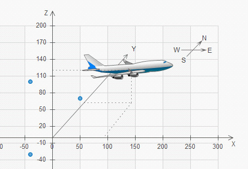

# LTE开发部 TL认证策划案
## 认证流程：
1. 团队选举2名TL候选人参与认证，候选人根据《无线研究院TL模型》提供自我举证材料
2. 评审组根据递交材料进行评分，符合基本级即可进入复试
3. 复试笔试
4. 复试代码演练，代码点评，代码PK
5. 候选人互评打分产生排名
6. 评审组根据候选人综合情况发布TL认证通过候选人

## TL主要职责
+ 技术实践推广（团队成员能力提升）
+ 研发效率提升
+ 团队代码质量提升

附:
### 笔试题目：
1. TL的主要职责是什么？
2. CleanCode有哪些关注点？
3. 我如何在团队中履行TL职责?

### 演练题目：
+ 无人机(Unmanned Aircraft)，又称无人驾驶机，是利用无线电遥感和自备程序控制的不载人飞机。
+ Z公司是一家无人机制造商，拟制造一款简易的无人机，它可以接受无线遥感指令，完成简单的动作。
+ 工程师使用四元组(x,y,z,d)表示无人机位置，其中(x,y,z)为其三维坐标位置，d为其朝向(包括**E**ast,**S**outh,**W**est,**N**orth)。
+ Aircraft初始位置为(0,0,0,N)，表示在原点，方向朝北

示意图如下：

#### 需求一：
+ 当Aircraft收到UP指令后，向上移动一个坐标
+ 当Aircraft收到DOWN指令后，向下移动一个坐标
+ 当Aircraft收到FORWARD指令后，向前移动一个坐标
+ 当Aircraft位于地面时(z为0时)，执行DOWN指令无响应

例如:Aircraft位于(0,0,5,N),当收到UP时，新的位置为(0,0,6,N)，继续收到DOWN时，新的位置为(0,0,5,N)，继续收到FORWARD时，新的位置为(0,1,5,N)
Quick Start: 需求一测试用例
```cpp
TEST(UnmannedAircraftTest, should_init_at_0_0_0_N)
{
    UnmannedAircraft ua;
    ASSERT_TRUE(Position(0,0,0,N) == ua.getPosition());
}

TEST(UnmannedAircraftTest, should_position_up_a_step_given_aircraft_at_origin)
{
    ASSERT_TRUE(Position(0,0,1,N) == UnmannedAircraft().on(UP));
}

TEST(UnmannedAircraftTest, should_position_down_a_step_given_position_is_0_0_5_N)
{
    UnmannedAircraft ua(Position(0,0,5,N));
    ASSERT_TRUE(Position(0,0,4,N) == ua.on(DOWN));
}

TEST(UnmannedAircraftTest, should_position_forward_a_step_given_aircraft_at_origin)
{
    ASSERT_TRUE(Position(0,1,0,N) == UnmannedAircraft().on(FORWARD));
}

```
#### 需求二
+ 当Aircraft收到LEFT指令后，向左转90度
+ 当Aircraft收到RIGHT指令后，向右转90度
+ 当Aircraft收到ROUND指令后，顺时针旋转180度

例如:Aircraft位于(0,0,0,N)，当收到LEFT时，新的位置为(0,0,0,W)，继续收到ROUND，新的位置为(0,0,0,E)，继续收到RIGHT后，新的位置为(0,0,0,S)

#### 需求三
+ 当Aircraft收到FORWARD_N(n)指令后，向前移动n个坐标
+ 当Aircraft收到UP_N(n)指令后，向上移动n个坐标
+ 当Aircraft收到DOWN_N(n)指令后，向下移动n个坐标

例如:Aircraft位于(0,0,0,N)，当收到FORWARD_N(10)，新的位置为(0,10,0,N)，继续收到UP_N(10)，新的位置为(0,10,10,N)，继续收到DOWN_N(5)，新的位置为(0,10,5,N)

#### 需求四
+ 当Aircraft收到REPEAT(instruction,n)指令后，循环执行instruction指令n次
+ instruction指令是除REPEAT指令之外的任意指令，n的范围为[0,10]

例如:Aircraft位于(0,0,0,N)，收到REPEAT(FORWARD,5)，新的位置为(0,5,0,N)，继续收到REPEAT(LEFT,1)，新的位置为(0,5,0,W)，继续收到REPEAT(FORWARD,5)，新的位置为(-5,5,0,W)，继续收到REPEAT(UP,5)，新的位置为(-5,5,5,W)
